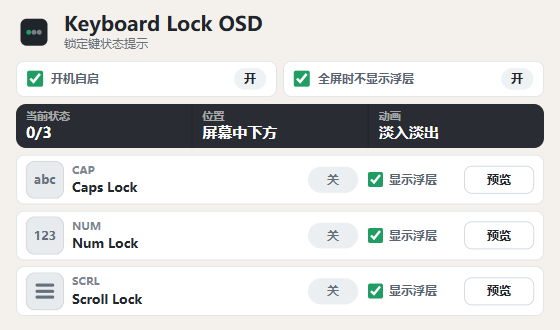

# Keyboard Lock OSD

[English](./README.md)

Keyboard Lock OSD 是一个面向 Windows 的轻量锁定键提示工具。它常驻系统托盘，在你按下 Caps Lock、Num Lock 或 Scroll Lock 时快速显示屏幕浮层，让当前状态一眼可见，同时不打断输入。

## 下载

[下载最新版 Windows 安装包](https://github.com/coderDJing/keyboard-lock-osd/releases/latest)。打开最新 Release 后下载 Windows `.exe` 安装包。

## 截图

### 大写锁定浮层


### 设置界面



## 主要功能

- 即时显示 Caps Lock、Num Lock、Scroll Lock 的开关状态。
- 使用屏幕中下方的简洁浮层提示，不打断当前输入和工作流。
- 支持为每个锁定键单独开启或关闭浮层提示。
- 设置界面可查看当前锁定键状态，并可直接预览浮层效果。
- 默认开机自启，启动后常驻系统托盘。
- 可设置全屏时隐藏浮层，避免打扰游戏、演示和视频播放。
- 支持中英文界面，会根据系统语言自动选择。
- 发布版通过 GitHub Releases 使用签名自动更新。

## 使用方式

1. 启动应用后，它会最小化到系统托盘。
2. 按下 Caps Lock、Num Lock 或 Scroll Lock，屏幕中下方会出现状态浮层。
3. 点击托盘图标打开设置界面。
4. 在设置界面里调整开机自启、全屏隐藏，以及每个锁定键是否显示浮层。

## 适合谁

- 键盘没有锁定键指示灯的笔记本用户。
- 外接键盘指示灯不明显、容易误触 Caps Lock 的用户。
- 希望在不打断输入的情况下确认锁定键状态的 Windows 用户。

## 开发

```powershell
pnpm install
pnpm tauri dev
```

## 验证

```powershell
pnpm run build
cargo check --manifest-path src-tauri/Cargo.toml
```
